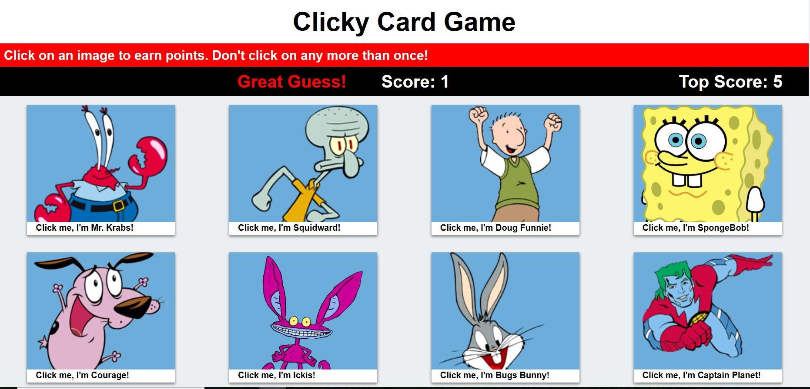

# ClickyGame

# memory game with React where application's UI is broken into components, manages component state, and responds to user events.

### ClickyGame screen

## How to play ClickyGame 
  
* Select one of the different images on the screen.
* The score is incremented when clicking an image for the first time. 
* If the same image is clicked more than once, the user’s score resets to 0 and the game restarts.
* Every time an image is clicked, the images rendered to the page shuffle themselves in a random order.
* Once the user's score is reset after an incorrect guess, the games restart.

# HAVE FUN!!

 

